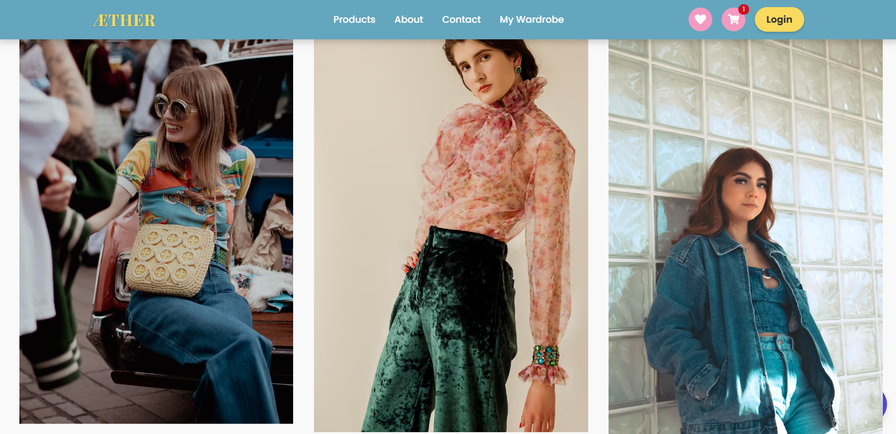

# AETHER – Your Digital Wardrobe


> **AETHER** is a full-stack e-commerce application that blends vintage and pop-culture fashion with modern AI technology. It features a dynamic shopping experience with an integrated AI stylist that provides personalized outfit recommendations based on body type and style preferences.

---

## 📸 Screenshots


*Home Page displaying curated collections*

---

## ✨ Key Features

### 🛍️ E-Commerce Functionality
* **Dynamic Product Catalog:** Browse clothing curated by vintage and pop-culture themes.
* **Shopping Cart:** Fully functional cart with add/remove/update capabilities.
* **Secure Payments:** Integrated payment gateway (Razorpay) for seamless transactions.
* **Order Management:** Users can view order history and status.

### 🤖 AI-Powered Stylist
* **Smart Chatbot:** An integrated AI assistant available 24/7.
* **Personalized Recommendations:** Suggests outfits based on user input (body type, occasion, and style preferences).
* **Style Advice:** Uses Generative AI (Gemini) to create unique fashion combinations.

### 🔐 Technical Highlights
* **Secure Authentication:** JWT (JSON Web Tokens) and bcrypt for secure user login and registration.
* **Responsive Design:** Built with Tailwind CSS for a mobile-first, adaptive interface.
* **RESTful API:** Robust backend architecture serving data to the client.

---

## 🛠️ Tech Stack

**Frontend:**
*  **React.js**
*  **Tailwind CSS**
*  **JavaScript (ES6+)**

**Backend:**
*  **Node.js**
*  **Express.js**
*  **MongoDB**

**Tools & Services:**
* **Authentication:** JWT, Bcrypt
* **AI Model:** Google Gemini API
* **Payment:** Razorpay
* **Version Control:** Git & GitHub
* **API Testing:** Postman

---

## 🚀 Getting Started Locally

Follow these steps to run the project on your local machine.

### Prerequisites
* Node.js installed
* MongoDB installed (or a MongoDB Atlas URI)
* Git installed

### 1. Clone the Repository
```bash
git clone [https://github.com/jasmine1711/AETHER.git](https://github.com/jasmine1711/AETHER.git)
cd AETHER
```

##📄 License
Distributed under the MIT License. See LICENSE for more information.

Developed with ❤️ by Tanushree Nayal